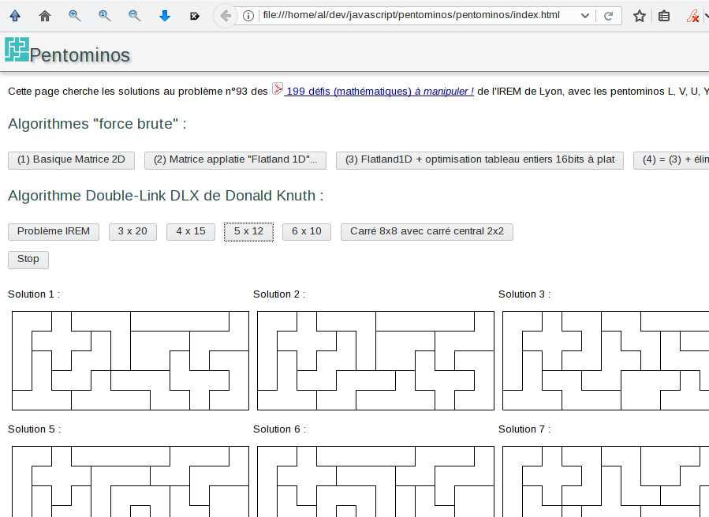

# JS Pentominos

## Recherche de solutions de Pentominos en Javascript 

Archive de mon travail sur la recherche des solutions au problème des puzzles de [pentominos (Wikipedia)](https://fr.wikipedia.org/wiki/Pentomino).

Nécessite un navigateur internet récent (Firefox ou Chromium) car utilise les toutes dernières nouveautés de JavaScript

### Démo : [pentominos](http://alouali.free.fr/pentominos)

Après avoir codé un algorithme par force brute et 3 optimisations successives (boutons n° 1 à 4), j'ai dévouvert et implémenté l'algorithme [Dancing Links](http://www-cs-faculty.stanford.edu/~knuth/papers/dancing-color.ps.gz) de [Donald Knuth](https://www-cs-faculty.stanford.edu/~knuth/)  

L'excellente idée de Donald Knuth est qu'il est très facile et peu couteux de remettre dans une liste doublement chainée un élément supprimé : or nous avons justement une recherche qui essaye plein de chemins et revient souvent en arrière.

Les performances de son algorithme sont très impressionnantes, et dépassent largement celles de recherche par force brute !

La plupart des solutions sont trouvées en quelques secondes ou moins.

### Architecture

- index.html : page principale de la démo
- main.js : script principal de la démo

#### Algorithmes

Ces algorithme sont chacun codés dans un WebWorker pour permettre de les lancer dans un thread en parallèle, ce qui permet d'utiliser les possibilités multicore des processeur d'aujourd'hui, et de ne pas geler l'interface pendant la recherche des solutions

#### Algorithmes Force Brute

- parallel.js : (1) Algorithme de recherche par force brute, sur des matrices en 2D
- parallel_flat.js : (2) Même chose mais sur une matrice applatie en 1D
- parallel_flat_asm.js : (3) Même chose avec optimisations pour pouvoir utiliser les tableaux d'entiers plus performants Uint16Array de JavaScripts. Avec comme objectif futur l'écriture en Asm.js, abandonné vu l'efficacité extraordinaire de l'algorithme DLX.
- parallel_flat_asm_2.js : (4) Même chose avec élimination plus tôt des positions impossibles.

#### Algorithme DLX

- parallel_dlx.js : Lance l'algorithme de recherche DLX de Donald Knuth. Le plus performant.

#### Librairies /lib

- utils.js : utilaires personnels et raccourcis pratiques JavaScript
- matrix.js : gestion de matrices 2D (Array de Array)
- dlx.js : implémentation de l'algorithme DLX
- jquery-3.3.1.min.js : gestion de l'interface utilisateur.

